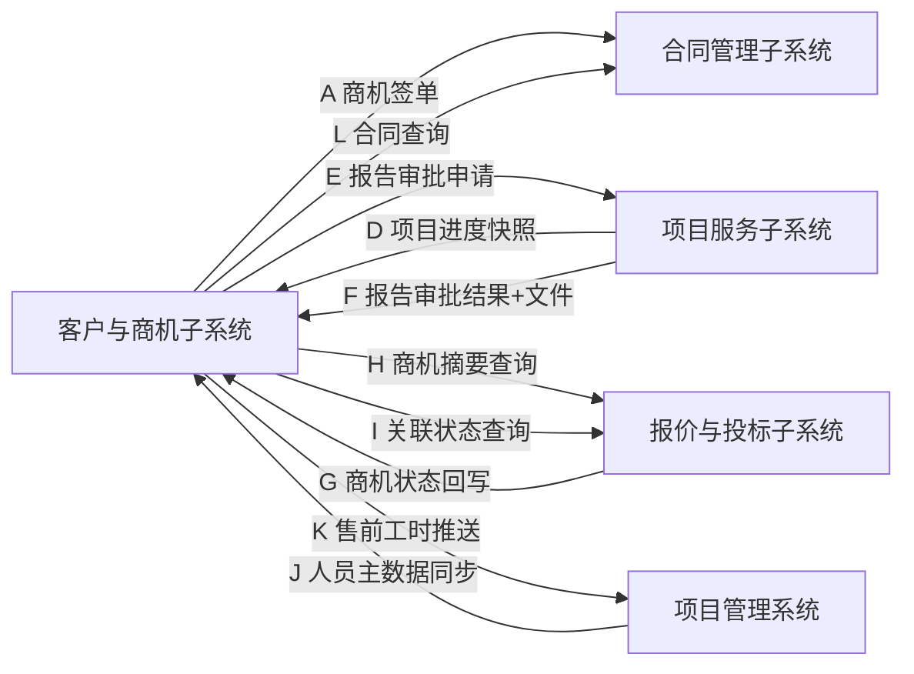

# 客户与商机管理子系统 — 跨子系统集成契约（T5）

> **M/N 契约覆盖声明（2026-07-31）**：Portal 外部客户已确认采用基础平台 OIDC。本文历史 M/N 中 `defaultPassword=11223344`、`forcePwdChange`、Portal 本地密码账号和首次强制改密字段作废。现行语义拆为 M1“CRM 预置基础平台外部用户并分配 Portal 角色”、M2“CRM 向 Portal 建立 `platformUserId/sub ↔ customerId` 映射”、N“邀请 verify 后走 OIDC，回调 sub 匹配才 consume”。详见 [`跨系统集成规格`](../开发需求文档/04-集成与验收/01-跨系统集成.md)。

| 文档信息 | |
|---|---|
| 文档版本 | T5（建议稿） |
| 编制日期 | 2026-07-07 |
| 上游基线 | 《需求说明书 V1.2》《ER 图 V1.0 §4》《API 接口契约 T4》 |
| 状态 | **建议（待下游系统对齐）** |
| 编制角色 | 产品通 + 集成契约设计 |
| 修订说明 | **V2.1 补丁（2026-07-27）**：依《商机状态管理需求更新 V2.1》联动——新增 L 合同查询（本系统←合同管理子系统）、G 回写可驱动终态（已签约/失败）并支持携带 contractId/lostReason、H/I 阶段枚举 5→7、字段映射/待对齐/Non-goals 同步更新。**V2.2 说明（待确认事项 8）**：信用评级功能（CM-003）已整体删除（详见 PRD V2.0 §0.2/§5.1、数据字典 V1.0、DDL T3）。T5 原未定义信用变更推送专属流（仅在 ER 图 V1.0 §4 提及「信用等级变更→合同」流向，随功能删除一并移除），故本契约无需改动信用相关条款。**V2.3 说明（CM-004 注册链接，2026-07-29）**：新增 **M 创建门户账号**（本系统→门户，同步创建账号、初始口令 11223344、强制改密）、**N 注册链接校验**（门户→本系统，verifyInvite 校验 2h token）；支撑客户与商机系统「生成注册链接」同步开通门户账号并下发注册链接；门户**不自注册**（见门户 PRD V1.0 §3 Non-Goals 7）。 |

> **Why**：M3 门户进度/报告依赖与合同、项目服务两个子系统的数据交换。本文档定义跨子系统数据流的方向、通道、载荷与可靠性，是上下游联调的契约基线。本系统**只推送/拉取数据，不生成合同草稿与报告文件本身**。

> **V2.1 补丁说明（2026-07-27）**：依《客户与商机管理子系统-商机状态管理需求更新-V2.1》联动修订——(1) 新增 **L 合同查询**（本系统 ← 合同管理子系统），支撑标记「已签约」时选择下游已存在合同；(2) **G 回写** 现可驱动商机至「已签约/失败」终态（含可选 `contractId`/`lostReason` 回传），人工覆盖优先（D3）；(3) **H/I** 阶段枚举由 5 扩为 7（新增 已签约/失败）；(4) 字段映射、待对齐事项、Non-goals 同步更新。

---

## 一、集成总览



| 编号 | 数据流 | 方向 | 通道 | 触发 | SLA |
|---|---|---|---|---|---|
| A | 商机签单推送 | 本系统→合同 | MQ 异步（至少一次） | 商机转合同 | 尽力而为 + 幂等 |
| D | 项目进度快照 | 项目服务→本系统 | 定时拉取（Feign，≤5min） | 每 5 分钟轮询 | ≤5 分钟延迟 |
| E | 报告审批申请 | 本系统→项目服务 | Feign 同步 | 客户提交报告申请 | 实时 |
| F | 报告审批结果+文件 | 项目服务→本系统 | Feign 回调 | 项目经理审批完成 | 实时 |
| G | 商机状态回写 | 报价与投标→本系统 | MQ 异步（至少一次） | 报价/投标状态变更 | 幂等 |
| H | 商机摘要查询 | 本系统→报价与投标 | Feign 同步 GET | 创建报价/投标关联商机 | 实时 |
| I | 关联状态查询 | 本系统←报价与投标 | Feign 同步 GET | 商机详情加载/阶段联动 | 实时 |
| J | 人员主数据同步 | 项目管理系统→本系统 | 定时拉取（Feign，每 6h）+手动刷新 | 周期同步/指派页刷新 | ≤6h 延迟 |
| K | 售前工时推送 | 本系统→项目管理系统 | MQ 异步（至少一次） | 工时提交 | 幂等 + 重试 |
| L | 合同查询 | 本系统←合同管理子系统 | Feign 同步 GET | 标记「已签约」/点击关联合同 | 实时 |
| M | 创建门户账号 | 本系统→门户 | Feign 同步 POST | 客户档案「生成注册链接（CM-004）」时同步创建门户账号 | 实时 |
| N | 注册链接校验 | 门户→本系统 | Feign 同步 GET | 客户点击注册链接进入门户激活页 | 实时 |

> **系统说明**：新增「项目管理系统（PMS）」与既有「项目服务子系统（PRJ）」为不同系统——PMS 承载技术/实施人员主数据与项目时间计划（对接 J/K），PRJ 承载项目执行进度快照与报告审批（对接 D/E/F）。

---

## 二、契约详述

### A. 商机签单推送（本系统 → 合同）
- **Topic**：`crm.contract.opportunity.signed`
- **幂等键**：`opportunityId`
- **Payload**
```json
{
  "eventType": "OPPORTUNITY_SIGNED",
  "opportunityId": "SJ202607070001",
  "customerId": "KH202607070001",
  "customerName": "某银行股份有限公司",
  "creditCode": "91310000XXXXXXXX0A",
  "oppType": "等保测评",
  "expectedAmount": 120000.00,
  "quotation": {
    "quotationId": "BJ202607070001",
    "totalAmount": 118000.00,
    "paymentTerms": [
      { "phaseName": "合同签定后10工作日", "payRatio": 0.5 },
      { "phaseName": "验收后", "payRatio": 0.5 }
    ],
    "servicePeriod": "90天",
    "items": [ { "serviceItem": "等保测评", "quantity": 1, "unitPrice": 118000, "amount": 118000 } ]
  },
  "occurredAt": "2026-07-07 22:00:00",
  "idempotencyKey": "SJ202607070001"
}
```

### D. 项目进度快照拉取（项目服务 → 本系统）
- **方式**：本系统每 **5 分钟** `GET /api/v1/projects/snapshots?customerId={id}`
- **写入**：`t_project_progress_snapshot`（覆盖式 upsert by projectId）
- **响应**
```json
{
  "snapshots": [
    {
      "projectId": "PJ20260001",
      "projectName": "某银行核心系统等保测评",
      "progressPct": 65,
      "currentStage": "整改中",
      "expectedEndDate": "2026-09-01",
      "delayed": false,
      "updatedAt": "2026-07-07 21:55:00"
    }
  ]
}
```
> 客户仅能看自身授权项目（门户权限 `data_scope` 控制）。

### E. 报告审批申请推送（本系统 → 项目服务）
- **方式**：`POST /api/v1/report/approval-request`
- **幂等键**：`requestId`
- **Payload**
```json
{
  "requestId": "RQ202607070001",
  "projectId": "PJ20260001",
  "customerId": "KH202607070001",
  "reportType": "测评报告",
  "requestReason": "客户验收需纸质+电子报告",
  "receiveEmail": "client@bank.com",
  "requestedBy": "portal_login_name",
  "requestedAt": "2026-07-07 21:00:00",
  "idempotencyKey": "RQ202607070001"
}
```

### F. 报告审批结果 + 文件回推（项目服务 → 本系统）
- **方式**：`POST /api/v1/portal/reports/callback`
- **幂等键**：`requestId`
- **本系统动作**：审批通过后对 `reportFileRef` 做 **AES-256 加密** → 写 `t_report_file` → 生成 72h 下载链接 → 写 `t_report_issue_log`
- **Payload**
```json
{
  "requestId": "RQ202607070001",
  "approveResult": "PASS",
  "approver": "项目经理",
  "approvedAt": "2026-07-07 22:10:00",
  "reportFileRef": "oss://project/report/original/RQ202607070001.pdf",
  "fileHash": "sha256:ab12...",
  "fileName": "测评报告.pdf",
  "idempotencyKey": "RQ202607070001"
}
```

---

### G. 商机状态回写（报价与投标子系统 → 本系统）【重点】

> 对应产品需求：客户与商机 PRD §7.2、报价与投标 PRD §8.2。商机的「报价 / 投标」两阶段实际执行状态，由报价与投标子系统在其单据状态变更时**回写**至本系统，本系统据此在商机详情/看板展示联动状态。
> 原型演示：报价与投标子系统 `pushOppStatus(oppName, type, status)` 写入 `localStorage['crm_opp_qb_status']`，管理端 `getOppQbStatus(oppName)` 读取（无则取商机自带 `qbStatus` 兜底）。**正式契约以 `opportunityId` 为权威关联键，`opportunityName` 冗余传输便于核对。**

- **Topic**：`crm.opportunity.qb.status.changed`
- **方向**：报价与投标子系统 → 本系统
- **通道**：MQ 异步（至少一次），下游按 `idempotencyKey` 去重
- **触发时机**：报价/投标状态发生变更——创建并关联商机（进入审批/标书制作）、审批通过/失效、开标、中标、落标
- **幂等键**：`sourceId + status`（报价单号/投标编号 + 状态）
- **Payload**
```json
{
  "eventType": "OPPORTUNITY_QB_STATUS_CHANGED",
  "opportunityId": "SJ202606140006",
  "opportunityName": "金融云安全合规服务",
  "type": "报价",
  "status": "报价已通过",
  "sourceId": "BJ202606150001",
  "sourceRef": "报价单 BJ202606150001",
  "sourceAmount": 485000.00,
  "changedBy": "财务经理/销售总监",
  "changedAt": "2026-06-14 16:45:00",
  "contractId": null,
  "lostReason": null,
  "idempotencyKey": "BJ202606150001-报价已通过"
}
```

**字段级契约（G）**

| 字段 | 类型 | 必填 | 约束 / 说明 |
|---|---|---|---|
| eventType | string | 是 | 固定 `OPPORTUNITY_QB_STATUS_CHANGED` |
| opportunityId | string | 是（正式）/ 否（原型） | 商机主键，权威关联键 |
| opportunityName | string | 是 | 商机名称，原型演示关联键；正式环境冗余传输 |
| type | enum | 是 | `报价` / `投标` |
| status | enum | 是 | 见下方《状态枚举映射》 |
| sourceId | string | 是 | 报价单号（BJ…） / 投标编号（TB…） |
| sourceRef | string | 否 | 单据可读引用 |
| sourceAmount | decimal | 否 | 报价/投标金额，供商机金额一致性校验 |
| changedBy | string | 否 | 操作人 / 审批角色 |
| changedAt | datetime | 是 | 状态变更时间，格式 `yyyy-MM-dd HH:mm:ss` |
| idempotencyKey | string | 是 | `sourceId + '-' + status` |
| contractId | string | 否 | 投标中标回传时可选携带；命中合同管理子系统合同，自动写入 `contract_ref`；为空则商机置「待关联合同」提示（配合 L 接口人工选合同） |
| lostReason | string | 否 | 投标落标回传时可选携带；落入 `lost_reason`；枚举同 V2.1 R2（价格/技术/关系/客户预算/竞争对手/其他）；为空则人工补填 |

**状态枚举映射（G-1）**

| 商机阶段（stage） | 来源 type | 回传 status | 本系统处置（仅更新 qb_status，不改 stage） |
|---|---|---|---|
| 报价 | 报价 | 报价审批中 | 阶段保持「报价」，看板/详情亮「审批中」提示 |
| 报价 | 报价 | 报价已通过 | 可推进至「投标」或签单判断；金额一致性校验 |
| 报价 | 报价 | 报价已失效 | 阶段回退至「方案制定」 |
| 投标 | 投标 | 投标标书制作 | 阶段保持「投标」 |
| 投标 | 投标 | 投标开标中 | 阶段保持「投标」 |
| 投标 | 投标 | 投标中标 | 推进至「已签约」（终态）；若回传携带 `contractId` 自动写入 `contract_ref`，否则置「待关联合同」提示，待合同同步后人工选择（满足 R1） |
| 投标 | 投标 | 投标落标 | 推进至「失败」（终态）；若回传含落标原因带入 `lost_reason`，否则人工补填（满足 R2） |

> **约束（V2.1 修订）**：回写**可驱动 `current_stage` 至终态**——「投标中标」推进至「已签约」、「投标落标」推进至「失败」（终态命名与 V2.1 统一）。其余推进阶段（报价/投标）的 `stage` 仍由商机系统基于 `qb_status` 决策或人工触发，报价与投标子系统不直接改主数据阶段（终态事件除外）。中标/落标回传可选携带 `contractId` / `lostReason` 以减少人工补录。**销售人工覆盖优先（D3）**：人工设置/覆盖任意阶段（含终态）时以人工为准，并仍需满足 R1/R2 强制校验。

### L. 合同查询（本系统 ← 合同管理子系统）【新增，V2.1】

> 对应产品需求：V2.1 D2——标记商机「已签约」时**必须**从合同管理子系统选择已存在的合同；本系统仅存 `contract_ref` 引用，不持有合同内容（沿用"只推送不生成"边界）。

- **方式**：`GET /api/v1/contracts?customerId={id}&keyword={noOrName}&status={status}`
- **触发**：商机进入「已签约」或用户点击"关联合同"
- **响应**
```json
{
  "contracts": [
    {
      "contractId": "HT202607200001",
      "contractNo": "HT-2026-0720-001",
      "contractName": "某银行核心系统等保测评服务合同",
      "customerId": "KH202607070001",
      "amount": 118000.00,
      "status": "已生效",
      "signDate": "2026-07-20"
    }
  ]
}
```
**字段级契约（L）**

| 字段 | 类型 | 必填 | 约束 / 说明 |
|---|---|---|---|
| contractId | string | 是 | 合同主键，写入商机 `contract_ref` |
| contractNo | string | 是 | 合同编号（展示用） |
| contractName | string | 是 | 合同名称 |
| customerId | string | 是 | 关联客户，须与商机 `customer_id` 一致（防误关联，V2.1 R1 配套） |
| amount | decimal | 否 | 合同金额，供签单金额一致性校验 |
| status | enum | 是 | 合同状态（草稿/已生效/执行中/已完结/已终止） |
| signDate | date | 否 | 签约日期 |

> 关联校验：所选合同 `customerId` 须等于商机 `customer_id`，否则拒绝关联（V2.1 R1 配套）。本系统仅缓存引用，不落合同正文。

### M. 创建门户账号（本系统 → 门户）【CM-004 新增】

> 对应产品需求：客户与商机 PRD §5.1 CM-004、§7.1；门户 PRD §5.1 CP-001 / §7。客户档案「生成注册链接」时，本系统**同步**调用门户创建账号（门户不自注册），随后本系统生成本地注册链接（token，2h 有效）写入 `t_portal_invite`。

- **方式**：`POST /api/v1/portal/accounts/provision`
- **触发**：客户详情「生成注册链接」点击，且前置校验通过（客户存在登记联系人且手机号非空）
- **幂等**：`customerId`（同一客户重复生成时，门户侧复用已有账号或返回既有 accountId；本系统旧链接置「已撤销」）
- **Payload**
```json
{
  "customerId": "KH202607070001",
  "loginName": "13800001234",
  "defaultPassword": "11223344",
  "forcePwdChange": true,
  "accountStatus": "待激活"
}
```
**字段级契约（M）**

| 字段 | 类型 | 必填 | 约束 / 说明 |
|---|---|---|---|
| customerId | string | 是 | 关联客户，门户账号 `customer_id` 须与其一致 |
| loginName | string | 是 | 默认用户名 = 客户登记联系人手机号；门户须唯一 |
| defaultPassword | string | 是 | 初始口令固定 `11223344`（明文仅本次传输，门户侧 BCrypt 哈希存储，本系统不留存） |
| forcePwdChange | bool | 是 | true=首次登录强制改密 |
| accountStatus | enum | 是 | 待激活（点击注册链接首次登录后改为正常） |

- **响应**：`{ "accountId": "PA202607290001", "status": "待激活" }`
- **失败处理**：门户不可用 / 创建失败 → 本系统**不生成注册链接**，前端提示重试；不残留半创建状态。

### N. 注册链接校验（门户 → 本系统）【CM-004 新增】

> 对应产品需求：客户与商机 PRD §5.1 CM-004、§7.1；门户 PRD §5.1 CP-001 / §7。客户点击注册链接进入门户激活页时，门户**回调本系统**校验 token 有效性，本系统返回客户/账号上下文供门户完成首次登录与强制改密。

- **方式**：`GET /api/v1/portal/invites/{token}/verify`
- **触发**：客户点击 `https://portal/activate?token={token}`
- **响应（有效）**
```json
{
  "valid": true,
  "customerId": "KH202607070001",
  "loginName": "13800001234",
  "phone": "13800001234",
  "expireAt": "2026-07-29 14:10:00",
  "accountId": "PA202607290001"
}
```
**字段级契约（N）**

| 字段 | 类型 | 必填 | 约束 / 说明 |
|---|---|---|---|
| valid | bool | 是 | token 是否有效 |
| customerId | string | 是（valid=true） | 关联客户 |
| loginName | string | 是（valid=true） | 预填登录名（手机号） |
| phone | string | 是（valid=true） | 登记联系人手机号 |
| expireAt | datetime | 是（valid=true） | 链接过期时间（生成时 +2h） |
| accountId | string | 是（valid=true） | 关联门户账号 |

- **失效返回**：`{ "valid": false, "reason": "EXPIRED|USED|REVOKED|NOT_FOUND" }`，门户按 reason 提示（链接已过期/已使用/已撤销/无效，引导联系销售重发）。
- **状态变更**：校验通过且门户完成首次登录后，本系统将 `t_portal_invite` 该 token 置「已使用」，门户将账号状态由「待激活」置「正常」。

### H. 商机摘要查询（本系统 → 报价与投标子系统）

> 报价与投标子系统创建报价/投标时，需关联商机——本接口供其拉取商机下拉。

- **方式**：`GET /api/v1/opportunities/summary?keyword={name}&customerId={id}&stage={stage}`
- **响应**
```json
{
  "opportunities": [
    {
      "opportunityId": "SJ202606140006",
      "opportunityName": "金融云安全合规服务",
      "customerId": "KH202606140001",
      "customerName": "华兴证券",
      "stage": "报价",
      "expectedAmount": 485000.00,
      "owner": "陈浩然"
    }
  ]
}
```
| 字段 | 类型 | 必填 | 说明 |
|---|---|---|---|
| opportunityId | string | 是 | 商机主键 |
| opportunityName | string | 是 | 商机名称 |
| customerId / customerName | string | 是 | 关联客户 |
| stage | enum | 是 | 商机阶段（初步接触/需求沟通/方案制定/报价/投标/**已签约/失败**） |
| expectedAmount | decimal | 否 | 预估金额 |
| owner | string | 否 | 商机负责人 |

### I. 关联状态查询（本系统 ← 报价与投标子系统）

> 本系统商机详情加载、阶段联动展示时，查询该商机下最新报价/投标状态。

- **方式**：`GET /api/v1/qb/by-opportunity?opportunityName={name}`（或 `opportunityId`）
- **响应**
```json
{
  "opportunityName": "金融云安全合规服务",
  "latest": {
    "type": "报价",
    "status": "已通过",
    "sourceId": "BJ202606150001",
    "sourceAmount": 485000.00,
    "changedAt": "2026-06-14 16:45:00"
  }
}
```

---

### J. 技术/实施人员主数据同步（项目管理系统 → 本系统）

> 对应产品需求：客户与商机 PRD（售前技术支持模块 TS-003 指派人员池）。技术/实施人员（部门、角色、技能、在职状态）由项目管理系统为权威来源，本系统定时拉取并缓存于 `t_ts_engineer_pool`，作为指派候选。

- **方式**：`GET /api/v1/pms/technicians?scope=tech`（定时每 6h + 手动刷新）
- **写入**：`t_ts_engineer_pool`（覆盖式 upsert by personId）
- **响应**
```json
{
  "technicians": [
    {
      "personId": "PMS-U10086",
      "personName": "王建国",
      "department": "安全技术部",
      "role": "实施工程师",
      "skillTags": ["等保", "云计算安全"],
      "contact": "138****0000",
      "validFlag": true,
      "syncedAt": "2026-07-23 08:00:00"
    }
  ]
}
```
**字段级契约（J）**

| 字段 | 类型 | 必填 | 约束 / 说明 |
|---|---|---|---|
| personId | string | 是 | PMS 人员主键，本系统不另建军号；工时推送 K 回写引用此 ID |
| personName | string | 是 | 姓名 |
| department | string | 是 | 部门 |
| role | enum | 是 | 技术总监 / 团队负责人 / 项目经理 / 实施工程师 |
| skillTags | string[] | 否 | 技能标签 |
| contact | string | 否 | 联系方式 |
| validFlag | bool | 是 | 在职可指派标记 |
| syncedAt | datetime | 是 | 同步时间 |

> 指派仅展示 `validFlag=true`；personId 停用由下次同步自动生效。

### K. 售前工时推送（本系统 → 项目管理系统）

> 对应产品需求：客户与商机 PRD（售前技术支持模块 TS-006）。已登记的售前工时推送至项目管理系统的「时间计划」，供其统计资源投入。T5 此前无 CRM→项目管理系统推送流，本流为新增。

- **Topic**：`crm.presale.worklog.created`
- **方向**：本系统 → 项目管理系统
- **通道**：MQ 异步（至少一次），下游按 `idempotencyKey` 去重
- **触发**：工时提交（TS-005 提交触发 TS-006）
- **幂等键**：`taskId + personId + workDate`
- **Payload**
```json
{
  "eventType": "PRESALE_WORKLOG_CREATED",
  "taskId": "TS202607230001",
  "opportunityId": "SJ202607070001",
  "opportunityName": "某银行核心系统等保测评售前",
  "personId": "PMS-U10086",
  "implementerDept": "安全技术部",
  "personName": "王建国",
  "workStartTime": "2026-07-23 09:00:00",
  "workEndTime": "2026-07-23 17:00:00",
  "unit": "人天",
  "workHours": 1.0,
  "rawUnit": "小时",
  "rawHours": 8.0,
  "workSiteAddress": "北京市朝阳区某银行数据中心",
  "supportType": "方案设计",
  "idempotencyKey": "TS202607230001-PMS-U10086-2026-07-23"
}
```
**字段级契约（K）**

| 字段 | 类型 | 必填 | 约束 / 说明 |
|---|---|---|---|
| eventType | string | 是 | 固定 `PRESALE_WORKLOG_CREATED` |
| taskId | string | 是 | 售前任务号（TS request_id） |
| opportunityId | string | 是 | 关联商机主键（溯源） |
| opportunityName | string | 否 | 商机名称（冗余便于核对） |
| personId | string | 是 | 实施人员主键，取自数据流 J 同步的 PMS 人员主数据 |
| implementerDept | string | 是 | 实施人员部门（Q1 指定） |
| personName | string | 是 | 姓名（Q1 指定） |
| workStartTime | datetime | 是 | 起止时间·开始（Q1 指定） |
| workEndTime | datetime | 是 | 起止时间·结束（Q1 指定） |
| unit | enum | 是 | 标准化推送单位：`人天`（Q5 决议：基准人天，小时登记按 `1 人天 = 8 小时` 换算；PMS 若以小时为口径则切换基准，影响面小） |
| workHours | decimal | 是 | 工时数值（按 unit 计） |
| workSiteAddress | string | 是 | 地址：工作地点（Q1 指定） |
| supportType | enum | 否 | 技术支持类型（方案设计/技术交流/POC演示/技术答疑/其他） |
| idempotencyKey | string | 是 | `taskId + '-' + personId + '-' + workDate` |
| rawUnit | enum | 否 | 原始登记单位（人天/小时），换算前口径，供审计溯源 |
| rawHours | decimal | 否 | 原始登记工时数值（按 rawUnit 计） |

> 推送失败指数退避重试（最多 6 次）后入死信，不阻断本系统主流程；失败时本系统 TS-006 状态置「待重试」并站内提示。

---

## 三、可靠性与异常处理

| 机制 | 约定 |
|---|---|
| 传输语义 | MQ 流（A）**至少一次**，下游须按 `idempotencyKey` 去重 |
| 重试 | MQ 消费失败指数退避重试（最多 6 次），进死信队列人工处理 |
| 同步超时 | Feign（D/E/F）超时 3s + 熔断，失败返回 5xx 由调用方重试 |
| 幂等 | 所有流以业务主键作幂等键；本系统下游回调（F）以 `requestId` 防重发放 |
| 数据一致性 | 快照（D）允许 ≤5min 延迟；推送类失败不影响本系统主流程 |
| 安全 | 跨系统调用走内网 + mTLS/服务鉴权；报文字段不落明文日志 |

---

## 四、字段映射（本系统表 ↔ 上下游）

| 本系统表 | 字段 | 上下游字段 |
|---|---|---|
| t_business_opportunity | opportunity_id / opp_type / expected_amount | A: 合同商机主键 / 类型 / 预估金额 |
| t_business_opportunity | qb_status_type / qb_status / qb_source_id / qb_source_amount | G: 报价与投标回写状态（终态可由回传驱动，人工覆盖优先） |
| t_business_opportunity | contract_ref | L: 合同管理子系统合同编号（跨系统引用，本系统不持有合同内容） |
| t_business_opportunity | lost_reason | G: 投标落标可选回传 / 人工补填（失败终态必填，V2.1 R2） |
| t_quotation | quotation_id / total_amount / payment_terms | A: 合同报价行 / 总额 / 付款计划 |
| t_project_progress_snapshot | project_id / progress_pct / current_stage | D: 项目服务进度 |
| t_report_request | request_id / report_type | E/F: 项目服务报告审批 |
| t_ts_engineer_pool | person_id / person_name / department / role | J: 项目管理系统人员主数据 |
| t_ts_worklog | request_id / person_id / work_hours / unit / work_site_address | K: 项目管理系统时间计划工时 |
| t_portal_invite | invite_id / customer_id / account_id / token / status / expire_at | M: 门户创建账号后本系统生成本地注册链接（2h）；N: 校验 token 有效性/状态（待使用/已使用/已过期/已撤销） |

---

## 五、待下游对齐事项

| 项 | 需合同系统确认 | 需项目服务确认 | 需报价与投标系统确认 | 需项目管理系统确认 |
|---|---|---|---|
| 合同草稿接收字段 | A payload 字段是否够用 | — | — |
| 快照接口路径/鉴权 | — | D 的 endpoint 与凭证 | — |
| 报告审批流程 | — | E/F 审批角色与文件格式 | — |
| 商机状态回写字段范围 | — | — | G：回写是否含金额/时间；stage 是否由本系统自主决策 |
| 关联商机/状态查询权限 | — | — | H/I：是否按客户/阶段过滤、鉴权方式 | — |
| 人员/工时对接 | — | — | — | J 人员主数据字段与 endpoint；K 工时推送以人天为基准单位（小时自动换算，见 K 字段级契约），**需 PMS 书面确认时间计划统计口径** |
| 合同查询（L） | L endpoint/鉴权/返回字段（合同号/金额/状态）；中标回传 `contractId` 是否与 L 返回一致 | — | G 中标回传是否携带 `contractId` / `lostReason` | — |
| 门户账号创建与链接校验（M/N） | — | — | — | 需门户系统确认：M provision endpoint/鉴权、默认口令 11223344 哈希策略、accountStatus 枚举（待激活/正常）；N verify endpoint 与 reason 枚举（EXPIRED/USED/REVOKED/NOT_FOUND）；forcePwdChange 强制改密与口令复杂度系统参数（见门户 PRD CP-001） |

---

## 六、Non-goals

- 不生成合同草稿（仅推送数据）。
- 不生成报告文件（仅通道 + 加密发放）。
- 不管理项目执行（仅拉快照）。
- 不接 IM/邮件/短信（通知降级站内）。
- 不主动修改商机**推进阶段**（G 回写可驱动至「已签约/失败」终态，但仍仅回写状态字段 + 终态事件；人工覆盖优先，详见 G 约束）。不持有合同内容（仅存 `contract_ref` 引用，见 L）。

---

**文档结束**
