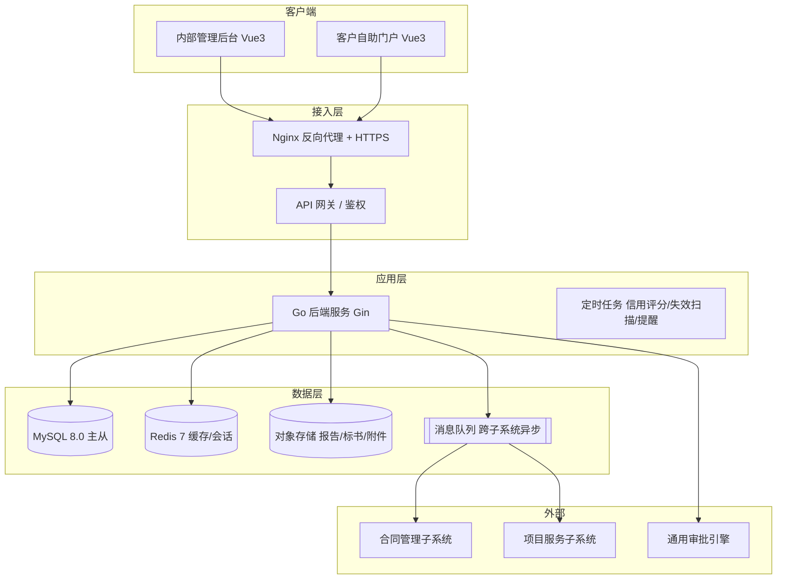

# 客户与商机管理子系统 — 技术栈建议文档（T1）

| 文档信息 | |
|---|---|
| 文档版本 | T1（建议稿） |
| 编制日期 | 2026-07-07 |
| 上游基线 | 《后续项目计划 V1.0》《需求说明书 V1.2》《ER 图 V1.0》 |
| 状态 | **建议（待技术负责人确认）** |
| 编制角色 | 产品通 + 技术选型建议 |

> **Why**：本子系统处于"设计收口→开发启动"临界点。需求已定版，但技术栈未选，导致 DDL、API 契约、前端原型均无法启动。本文档给出**与合同管理系统一致的推荐栈**，降低 6 子系统协同成本。

---

## 一、总体架构（分层）

---

## 二、技术选型明细

| 层 | 候选 | **选定（Recommended）** | 理由 | 备选 |
|---|---|---|---|---|
| 后端语言/框架 | Go+Gin / Go+Echo / Java+Spring | **Go + Gin** | 与合同系统一致；高并发、部署轻 | Go+Echo |
| ORM | GORM / sqlx / ent | **GORM** | 开发效率高，迁移友好 | sqlx（性能极致） |
| 前端框架 | Vue3 / React | **Vue3 + Vite + TS** | 与合同系统一致，表单密集型友好 | React |
| UI 组件库 | Element Plus / Ant Design Vue / Naive UI | **Element Plus** | 企业后台表单/表格场景成熟 | Naive UI |
| 数据库 | MySQL 8.0 / PostgreSQL | **MySQL 8.0 (InnoDB)** | 合同系统同款；JSON 存 competitor_info；生态成熟 | PostgreSQL |
| 缓存 | Redis 7 | **Redis 7** | 会话、看板、查重缓存 | — |
| 对象存储 | 腾讯云 COS / MinIO | **兼容 S3 的对象存储** | 报告/标书/附件落地，AES-256 加密存储 | 本地磁盘（不推荐） |
| 消息队列 | RabbitMQ / RocketMQ | **RabbitMQ（默认）**；RocketMQ 若司内标准 | 跨子系统推送（商机/中标/信用）解耦 | 司内 MQ |
| 定时任务 | go-cron / XXL-JOB | **XXL-JOB（分布式）**；单机可 go-cron | 信用评分每日 02:00、报价失效、保证金提醒 | 进程内 cron |
| 全文检索 | MySQL 全文索引 / ES | **MySQL 全文索引（起步）**，ES 视量扩展 | 客户查询 ≤2s，100+ 并发够用 | Elasticsearch |
| 审批引擎 | Flowable / 自研轻量 | **通用审批引擎（待定）** | 4 类审批流实例化 | 自研审批表 |
| 网关/鉴权 | Nginx + JWT | **Nginx + JWT** | 轻量，满足等保 | Kong |
| 日志/监控 | 应用日志 + 审计表 | **应用日志 + 审计表 + Prometheus(可选)** | 等保需审计留存 | Grafana |
| 部署 | Docker + K8s | **Docker + 司内 anydev / K8s** | CI/CD 复用 GitHub Actions | 虚拟机 |

---

## 三、与合同管理系统的一致性

| 维度 | 合同系统（已定） | 本子系统（建议） | 一致性收益 |
|---|---|---|---|
| 后端 | Go | Go + Gin | 团队技能复用、代码模板复用 |
| 前端 | Vue3 | Vue3 + Element Plus | 组件库、权限框架复用 |
| 数据库 | MySQL | MySQL 8.0 | DBA/备份/容灾策略统一 |
| 部署 | 司内环境 | 同环境 | CI/CD、等保测评统一推进 |

> **建议**：6 子系统统一技术中台，避免"各自为政"导致的集成与运维成本翻倍。

---

## 四、数据层设计要点

1. **字符集**：全库 `utf8mb4 / utf8mb4_0900_ai_ci`，支持中文枚举与表情。
2. **主键**：沿用业务编号（`KH/SJ/BJ+YYYYMMDD+4位流水`）作 `VARCHAR(20)` 主键，与应用层生成规则一致；如需分库，后续可加 `BIGINT` 代理主键（本期不做）。
3. **软删除**：`customer_status='作废'` / `opp_status='已作废'` / `is_archived=1` + `end_date` 实现，**禁止物理 DELETE**；所有列表查询默认过滤已作废/已归档。
4. **敏感字段**：`phone`、`bank_account` 等脱敏字段，存储层 AES-256 加密 + 应用层按角色脱敏展示（详见 V1.3 非功能）。
5. **多态附件**：`t_attachment` 用 `biz_type + biz_id` 联合索引，**不建数据库外键**，由应用层约束。
6. **JSON 字段**：`competitor_info`、`preference_tags`、`support_team`、`reminder_channels`、`project_ids`、`ip_whitelist`、`clarification_files`、`attachment_ids` 用 `JSON` 类型。
7. **审计表**：`t_customer_log`、`t_customer_communication`、`t_portal_login_log` 等永久留存，支撑等保追溯。

---

## 五、安全与等保三级合规

| 要求 | 落地方式 |
|---|---|
| 身份鉴别 | 门户登录失败 5 次锁 15 分钟；密码强度校验；双因素（本期站内验证码，预留短信） |
| 访问控制 | RBAC 细粒度；敏感字段按角色脱敏 |
| 数据安全 | 敏感字段 AES-256 存储；报告文件 AES-256 加密 + 水印；国密 SM4 预留开关 |
| 安全审计 | 全量操作/登录/发放日志永久留存 |
| 备份恢复 | 每日全量 + 增量（RPO/RTO 由 V1.3 定）；对象存储多副本 |
| 通信安全 | 全站 HTTPS；邀请码一次有效 |

---

## 六、开发规范（约定）

- 字段命名 `snake_case`，与数据字典严格一致。
- 所有表由 ORM 统一维护 `created_time` / `updated_time`。
- 业务编号生成规则集中在服务层工具类，禁止散落。
- API 统一 RESTful + JWT；跨子系统用 MQ/Feign，本期站内通知。
- 枚举值以数据字典 V1.0 全集为准，新增需业务方确认。

---

## 七、风险与待确认

| 项 | 说明 | 建议 |
|---|---|---|
| 审批引擎选型 | 通用审批引擎方案"待定" | M0 内定方案，否则自研轻量审批表 |
| 消息队列 | 跨子系统异步通道未定 | 默认 RabbitMQ，遵从司内标准 |
| 国密 SM4 | V1.3 预留 | 先 AES-256，SM4 做开关 |
| 搜索引擎 | 客户量增长后全文检索 | 起用 MySQL 全文，超阈值切 ES |

---

## 八、Non-goals（本期不做）

- 不接 IM/邮件/短信三方（仅站内消息，字段预留）。
- 不生成测评报告文件（CP-003 仅通道）。
- 不管理项目执行（CP-002 仅拉快照）。
- 不生成合同草稿（转合同仅推送数据）。

---

**文档结束**
