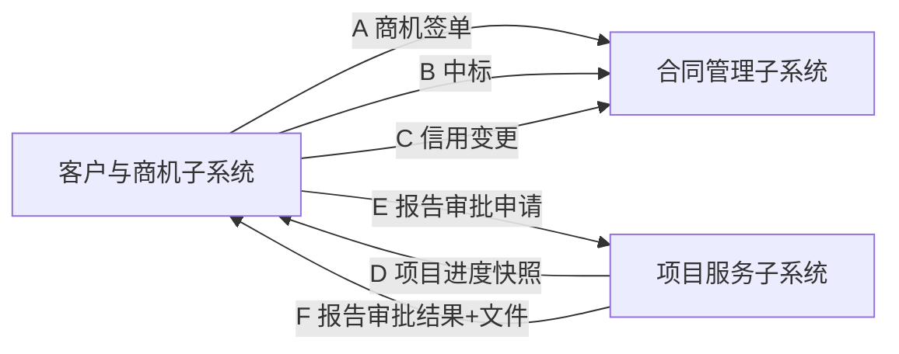

# 客户与商机管理子系统 — 跨子系统集成契约（T5）

| 文档信息 | |
|---|---|
| 文档版本 | T5（建议稿） |
| 编制日期 | 2026-07-07 |
| 上游基线 | 《需求说明书 V1.2》《ER 图 V1.0 §4》《API 接口契约 T4》 |
| 状态 | **建议（待下游系统对齐）** |
| 编制角色 | 产品通 + 集成契约设计 |

> **Why**：M2 投标推送、M3 门户进度/报告都依赖与合同、项目服务两个子系统的数据交换。本文档定义 5 条数据流的方向、通道、载荷与可靠性，是上下游联调的契约基线。本系统**只推送/拉取数据，不生成合同草稿与报告文件本身**。

---

## 一、集成总览



| 编号 | 数据流 | 方向 | 通道 | 触发 | SLA |
|---|---|---|---|---|---|
| A | 商机签单推送 | 本系统→合同 | MQ 异步（至少一次） | 商机转合同 | 尽力而为 + 幂等 |
| B | 中标推送 | 本系统→合同 | MQ 异步 | 投标中标 | 尽力而为 + 幂等 |
| C | 信用等级变更推送 | 本系统→合同 | MQ 异步 | 信用审批生效 | 尽力而为 + 幂等 |
| D | 项目进度快照 | 项目服务→本系统 | 定时拉取（Feign，≤5min） | 每 5 分钟轮询 | ≤5 分钟延迟 |
| E | 报告审批申请 | 本系统→项目服务 | Feign 同步 | 客户提交报告申请 | 实时 |
| F | 报告审批结果+文件 | 项目服务→本系统 | Feign 回调 | 项目经理审批完成 | 实时 |

---

## 二、契约详述

### A. 商机签单推送（本系统 → 合同）
- **Topic**：`crm.contract.opportunity.signed`
- **幂等键**：`opportunityId`
- **Payload**
```json
{
  "eventType": "OPPORTUNITY_SIGNED",
  "opportunityId": "SJ202607070001",
  "customerId": "KH202607070001",
  "customerName": "某银行股份有限公司",
  "creditCode": "91310000XXXXXXXX0A",
  "oppType": "等保测评",
  "expectedAmount": 120000.00,
  "quotation": {
    "quotationId": "BJ202607070001",
    "totalAmount": 118000.00,
    "paymentTerms": [
      { "phaseName": "合同签定后10工作日", "payRatio": 0.5 },
      { "phaseName": "验收后", "payRatio": 0.5 }
    ],
    "servicePeriod": "90天",
    "items": [ { "serviceItem": "等保测评", "quantity": 1, "unitPrice": 118000, "amount": 118000 } ]
  },
  "occurredAt": "2026-07-07 22:00:00",
  "idempotencyKey": "SJ202607070001"
}
```

### B. 中标推送（本系统 → 合同）
- **Topic**：`crm.contract.bid.won`
- **幂等键**：`bidId`
- **Payload**
```json
{
  "eventType": "BID_WON",
  "bidId": "BD202607070001",
  "opportunityId": "SJ202607070001",
  "customerId": "KH202607070001",
  "projectName": "某银行核心系统等保测评",
  "bidCode": "XXXX-2026",
  "winningNoticeRef": "oss://crm/bid/winning/BD202607070001.pdf",
  "bidRank": 1,
  "bidResultTime": "2026-07-07 15:00:00",
  "occurredAt": "2026-07-07 15:30:00",
  "idempotencyKey": "BD202607070001"
}
```

### C. 信用等级变更推送（本系统 → 合同）
- **Topic**：`crm.credit.changed`
- **幂等键**：`customerId + changedAt`
- **Payload**
```json
{
  "eventType": "CREDIT_CHANGED",
  "customerId": "KH202607070001",
  "customerName": "某银行股份有限公司",
  "creditCode": "91310000XXXXXXXX0A",
  "oldLevel": "B", "newLevel": "A", "creditScore": 92,
  "changedBy": "销售总监/财务总监",
  "changedAt": "2026-07-07 20:00:00",
  "idempotencyKey": "KH202607070001-20260707200000"
}
```

### D. 项目进度快照拉取（项目服务 → 本系统）
- **方式**：本系统每 **5 分钟** `GET /api/v1/projects/snapshots?customerId={id}`
- **写入**：`t_project_progress_snapshot`（覆盖式 upsert by projectId）
- **响应**
```json
{
  "snapshots": [
    {
      "projectId": "PJ20260001",
      "projectName": "某银行核心系统等保测评",
      "progressPct": 65,
      "currentStage": "整改中",
      "expectedEndDate": "2026-09-01",
      "delayed": false,
      "updatedAt": "2026-07-07 21:55:00"
    }
  ]
}
```
> 客户仅能看自身授权项目（门户权限 `data_scope` 控制）。

### E. 报告审批申请推送（本系统 → 项目服务）
- **方式**：`POST /api/v1/report/approval-request`
- **幂等键**：`requestId`
- **Payload**
```json
{
  "requestId": "RQ202607070001",
  "projectId": "PJ20260001",
  "customerId": "KH202607070001",
  "reportType": "测评报告",
  "requestReason": "客户验收需纸质+电子报告",
  "receiveEmail": "client@bank.com",
  "requestedBy": "portal_login_name",
  "requestedAt": "2026-07-07 21:00:00",
  "idempotencyKey": "RQ202607070001"
}
```

### F. 报告审批结果 + 文件回推（项目服务 → 本系统）
- **方式**：`POST /api/v1/portal/reports/callback`
- **幂等键**：`requestId`
- **本系统动作**：审批通过后对 `reportFileRef` 做 **AES-256 加密** → 写 `t_report_file` → 生成 72h 下载链接 → 写 `t_report_issue_log`
- **Payload**
```json
{
  "requestId": "RQ202607070001",
  "approveResult": "PASS",
  "approver": "项目经理",
  "approvedAt": "2026-07-07 22:10:00",
  "reportFileRef": "oss://project/report/original/RQ202607070001.pdf",
  "fileHash": "sha256:ab12...",
  "fileName": "测评报告.pdf",
  "idempotencyKey": "RQ202607070001"
}
```

---

## 三、可靠性与异常处理

| 机制 | 约定 |
|---|---|
| 传输语义 | MQ 流（A/B/C）**至少一次**，下游须按 `idempotencyKey` 去重 |
| 重试 | MQ 消费失败指数退避重试（最多 6 次），进死信队列人工处理 |
| 同步超时 | Feign（D/E/F）超时 3s + 熔断，失败返回 5xx 由调用方重试 |
| 幂等 | 所有流以业务主键作幂等键；本系统下游回调（F）以 `requestId` 防重发放 |
| 数据一致性 | 快照（D）允许 ≤5min 延迟；推送类失败不影响本系统主流程 |
| 安全 | 跨系统调用走内网 + mTLS/服务鉴权；报文字段不落明文日志 |

---

## 四、字段映射（本系统表 ↔ 上下游）

| 本系统表 | 字段 | 上下游字段 |
|---|---|---|
| t_business_opportunity | opportunity_id / opp_type / expected_amount | A: 合同商机主键 / 类型 / 预估金额 |
| t_quotation | quotation_id / total_amount / payment_terms | A: 合同报价行 / 总额 / 付款计划 |
| t_bid_project | bid_id / bid_status=中标 | B: 合同投标关联 |
| t_customer | credit_level / credit_score | C: 合同信用等级 |
| t_project_progress_snapshot | project_id / progress_pct / current_stage | D: 项目服务进度 |
| t_report_request | request_id / report_type | E/F: 项目服务报告审批 |

---

## 五、待下游对齐事项

| 项 | 需合同系统确认 | 需项目服务确认 |
|---|---|---|
| 合同草稿接收字段 | A/B payload 字段是否够用 | — |
| 信用变更消费方 | C 是否接入结算 | — |
| 快照接口路径/鉴权 | — | D 的 endpoint 与凭证 |
| 报告审批流程 | — | E/F 审批角色与文件格式 |

---

## 六、Non-goals

- 不生成合同草稿（仅推送数据）。
- 不生成报告文件（仅通道 + 加密发放）。
- 不管理项目执行（仅拉快照）。
- 不接 IM/邮件/短信（通知降级站内）。

---

**文档结束**
