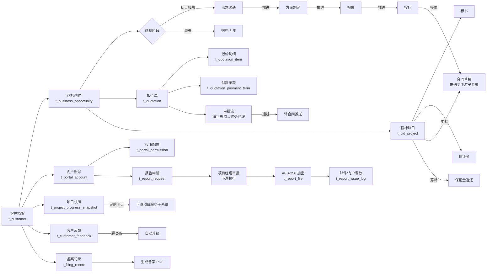

# 客户与商机管理子系统 ER 图 V1.0

| 文档信息 | |
|---|---|
| 文档版本 | V1.0 |
| 编制日期 | 2026-06-14 |
| 上游基线 | 《数据字典 V1.0》 |
| 适用对象 | 数据库设计 / 后端开发 / 测试 |
| 渲染工具 | Mermaid（飞书 / Typora / VSCode / mermaid-cli） |

---

## 0. 说明

- 本 ER 图覆盖数据字典 V1.0 全部 23 张业务表
- 跨子系统边界（合同/项目）通过"推送数据"和"同步快照"标注，不在 ER 图内建表
- 多态附件（`t_attachment`）通过 `biz_type + biz_id` 联合唯一索引实现，不建数据库外键
- 所有外键级联策略见 §3 关系说明

---

## 1. 实体关系总览图

```mermaid
erDiagram
    %% ===== 客户主数据 =====
    t_customer ||--o{ t_customer_biz : "1:N 业务信息"
    t_customer ||--o{ t_customer_org : "1:N 组织架构"
    t_customer ||--o{ t_customer_stakeholder : "1:N 干系人"
    t_customer ||--o{ t_customer_system : "1:N 系统清单"
    t_customer ||--o{ t_customer_finance : "1:1 财务信息"
    t_customer ||--o{ t_customer_log : "1:N 操作日志"
    t_customer ||--o{ t_customer_communication : "1:N 沟通记录"
    t_customer ||--o{ t_business_opportunity : "1:N 商机"
    t_customer ||--o{ t_quotation : "1:N 报价单"
    t_customer ||--o{ t_project_progress_snapshot : "1:N 项目快照"
    t_customer ||--o{ t_customer_feedback : "1:N 反馈"
    t_customer ||--o{ t_filing_record : "1:N 备案"
    t_customer ||--o{ t_portal_account : "1:N 门户账号"
    t_customer }o--o| t_customer : "自关联：合并"

    %% ===== 商机域 =====
    t_business_opportunity ||--o{ t_opportunity_follow : "1:N 跟进记录"
    t_business_opportunity ||--o{ t_opportunity_approval : "1:N 阶段审批"
    t_business_opportunity ||--o{ t_quotation : "1:N 报价单"
    t_business_opportunity ||--o{ t_bid_project : "1:N 投标项目"

    %% ===== 报价域 =====
    t_quotation ||--o{ t_quotation_item : "1:N 报价明细"
    t_quotation ||--o{ t_quotation_payment_term : "1:N 付款条款"
    t_quotation ||--o{ t_quotation_approval : "1:N 审批节点"
    t_quotation ||--|| t_approval_instance : "1:1 审批流程实例"

    %% ===== 投标域 =====
    t_bid_project ||--o{ t_bid_document : "1:N 标书"
    t_bid_project ||--o{ t_bid_deposit : "1:N 保证金"

    %% ===== 门户域 =====
    t_portal_account ||--|| t_portal_permission : "1:1 权限"
    t_portal_account ||--o{ t_portal_login_log : "1:N 登录日志"
    t_portal_account ||--o{ t_report_request : "1:N 报告申请"
    t_portal_account ||--o{ t_customer_feedback : "1:N 反馈"
    t_portal_account ||--o{ t_service_evaluation : "1:N 评价"
    t_portal_account ||--o{ t_filing_record : "1:N 备案"

    t_report_request ||--|| t_report_file : "1:1 报告文件"
    t_report_request ||--o{ t_report_issue_log : "1:N 发放日志"

    %% ===== 通用 =====
    t_customer_stakeholder ||--o{ t_customer_communication : "1:N 沟通"
    t_attachment }o--o{ t_business_opportunity : "N:N 附件(多态)"
    t_attachment }o--o{ t_quotation : "N:N 附件(多态)"
    t_attachment }o--o{ t_bid_project : "N:N 附件(多态)"
    t_attachment }o--o{ t_filing_record : "N:N 附件(多态)"

    %% ===== 实体定义 =====
    t_customer {
        string customer_id PK
        string customer_name
        string customer_type
        string credit_code
        string industry
        string enterprise_scale
        string customer_status
        string credit_level
        int credit_score
        bool risk_flag
        bool is_merged
        string merged_to FK
        date end_date
    }

    t_business_opportunity {
        string opportunity_id PK
        string customer_id FK
        string opp_name
        string opp_source
        string opp_type
        decimal expected_amount
        date expected_sign_date
        string current_stage
        string opp_status
        string sales_owner
        string lost_reason
        bool is_archived
        date end_date
    }

    t_quotation {
        string quotation_id PK
        string opportunity_id FK
        string customer_id FK
        date quotation_date
        date effective_end_date
        decimal subtotal
        decimal discount_amount
        decimal tax_amount
        decimal total_amount
        bool payment_terms_default
        string quotation_status
        int version
        bool below_price_flag
    }

    t_quotation_payment_term {
        string term_id PK
        string quotation_id FK
        string phase_name
        decimal pay_ratio
        string condition_desc
        int sort_order
    }

    t_bid_project {
        string bid_id PK
        string opportunity_id FK
        string project_name
        string bid_code
        date bid_deadline
        string bid_status
        int bid_rank
    }

    t_bid_deposit {
        string deposit_id PK
        string bid_id FK
        decimal amount
        date expected_refund_date
        string refund_status
    }

    t_portal_account {
        string account_id PK
        string customer_id FK
        string login_name
        string contact_phone
        string invite_code
        bool invite_used
        string status
        bool two_factor_enabled
    }

    t_portal_permission {
        string perm_id PK
        string account_id FK
        string data_scope
    }

    t_report_request {
        string request_id PK
        string account_id FK
        string project_id
        string report_type
        string receive_email
        string request_status
        string encrypt_method
        string download_password
        datetime link_expire_time
    }

    t_report_file {
        string file_id PK
        string request_id FK
        string encrypted_path
        bool frozen_flag
    }

    t_customer_feedback {
        string feedback_id PK
        string account_id FK
        string customer_id FK
        string project_id
        string feedback_type
        string handle_status
        bool escalated_flag
    }

    t_service_evaluation {
        string eval_id PK
        string project_id
        string account_id FK
        decimal avg_score
        bool anonymous_flag
        bool push_to_management
    }

    t_filing_record {
        string filing_id PK
        string account_id FK
        string customer_id FK
        string security_level
        string filing_status
    }

    t_project_progress_snapshot {
        string snapshot_id PK
        string project_id
        string customer_id FK
        int progress_pct
        bool delayed_flag
    }

    t_approval_instance {
        string approval_flow_id PK
        string biz_type
        string biz_id
        int current_node
        string status
    }

    t_attachment {
        string attachment_id PK
        string biz_type
        string biz_id
    }
```



---

## 2. 核心数据流转图（横切视图）



---

## 3. 实体关系文字说明

### 3.1 客户域（核心主数据）

| 关系 | 父表 | 子表 | 关联字段 | 级联策略 | 备注 |
|---|---|---|---|---|---|
| 业务信息 | t_customer | t_customer_biz | customer_id | ON DELETE RESTRICT | 一客多业务类型 |
| 组织架构 | t_customer | t_customer_org | customer_id | ON DELETE RESTRICT | |
| 干系人 | t_customer | t_customer_stakeholder | customer_id | ON DELETE RESTRICT | |
| 系统清单 | t_customer | t_customer_system | customer_id | ON DELETE RESTRICT | |
| 财务信息 | t_customer | t_customer_finance | customer_id | ON DELETE RESTRICT | 一客一账 |
| 操作日志 | t_customer | t_customer_log | customer_id | ON DELETE RESTRICT | 永久留存 |
| 沟通记录 | t_customer | t_customer_communication | customer_id | ON DELETE RESTRICT | |
| **合并自关联** | t_customer | t_customer | merged_to → customer_id | ON DELETE SET NULL | 合并后历史客户保留 |

### 3.2 商机域

| 关系 | 父表 | 子表 | 关联字段 | 级联策略 | 备注 |
|---|---|---|---|---|---|
| 商机主从 | t_customer | t_business_opportunity | customer_id | ON DELETE RESTRICT | 客户作废 → 商机转归档 |
| 跟进记录 | t_business_opportunity | t_opportunity_follow | opportunity_id | ON DELETE CASCADE | |
| 阶段审批 | t_business_opportunity | t_opportunity_approval | opportunity_id | ON DELETE CASCADE | |
| 报价单 | t_business_opportunity | t_quotation | opportunity_id | ON DELETE RESTRICT | 报价生效后不允许删商机 |
| 投标项目 | t_business_opportunity | t_bid_project | opportunity_id | ON DELETE RESTRICT | |

### 3.3 报价域

| 关系 | 父表 | 子表 | 关联字段 | 级联策略 |
|---|---|---|---|---|
| 报价明细 | t_quotation | t_quotation_item | quotation_id | ON DELETE CASCADE |
| **付款条款** | t_quotation | t_quotation_payment_term | quotation_id | ON DELETE CASCADE |
| 审批节点 | t_quotation | t_quotation_approval | quotation_id | ON DELETE CASCADE |
| 审批流程实例 | t_quotation | t_approval_instance | biz_id | ON DELETE RESTRICT |

### 3.4 投标域

| 关系 | 父表 | 子表 | 关联字段 | 级联策略 |
|---|---|---|---|---|
| 标书 | t_bid_project | t_bid_document | bid_id | ON DELETE CASCADE |
| 保证金 | t_bid_project | t_bid_deposit | bid_id | ON DELETE CASCADE |

### 3.5 门户域

| 关系 | 父表 | 子表 | 关联字段 | 级联策略 |
|---|---|---|---|---|
| 权限 | t_portal_account | t_portal_permission | account_id | ON DELETE CASCADE |
| 登录日志 | t_portal_account | t_portal_login_log | account_id | ON DELETE CASCADE |
| 报告申请 | t_portal_account | t_report_request | account_id | ON DELETE RESTRICT |
| 反馈 | t_portal_account | t_customer_feedback | account_id | ON DELETE RESTRICT |
| 评价 | t_portal_account | t_service_evaluation | account_id | ON DELETE RESTRICT |
| 备案 | t_portal_account | t_filing_record | account_id | ON DELETE RESTRICT |
| 报告文件 | t_report_request | t_report_file | request_id | ON DELETE CASCADE |
| 发放日志 | t_report_request | t_report_issue_log | request_id | ON DELETE CASCADE |

### 3.6 通用附件（多态关联）

`t_attachment` 与多张业务表都是 **多态关联**：

| biz_type | biz_id 关联到 |
|---|---|
| OPPORTUNITY | t_business_opportunity.opportunity_id |
| QUOTATION | t_quotation.quotation_id |
| BID | t_bid_project.bid_id |
| FILING | t_filing_record.filing_id |
| REPORT | t_report_file.file_id |

> **设计建议**：biz_type + biz_id 上加联合唯一索引 + 联合外键可通过应用层约束（数据库层不做 FK）。

---

## 4. 跨子系统边界（ER 图外）

> 这些是**本系统写出/读入**的数据流向，ER 图里不建表，通过接口/消息队列实现：

| 数据方向 | 数据内容 | 通道 | 对接方 |
|---|---|---|---|
| 本系统 → 下游 | 商机/中标数据 | 同步 Feign / 异步 MQ | 合同管理子系统 |
| 下游 → 本系统 | 项目进度快照（≤5 分钟） | 同步 Feign / 定时拉取 | 项目服务管理子系统 |
| 本系统 → 下游 | 信用等级变更 | 异步 MQ | 合同管理子系统 |
| 下游 → 本系统 | 报告审批结果 | 同步 Feign | 项目服务管理子系统 |
| 下游 → 本系统 | 报告文件（审批通过后） | 对象存储 + Feign | 项目服务管理子系统 |

**本期不接 IM/邮件/短信三方**，所有通知降级为站内消息，字段已预留扩展位。

---

## 5. 索引设计建议

| 表 | 索引字段 | 类型 | 用途 |
|---|---|---|---|
| t_customer | (customer_name, credit_code) | 普通 | 查重 |
| t_customer | (customer_status, credit_level) | 联合 | 列表筛选 |
| t_customer | (is_merged, merged_to) | 联合 | 合并查询 |
| t_customer | (end_date) | 普通 | 6 年保留期扫描 |
| t_business_opportunity | (customer_id, current_stage) | 联合 | 客户商机看板 |
| t_business_opportunity | (opp_status, is_archived) | 联合 | 跟进中/归档 |
| t_business_opportunity | (sales_owner, expected_sign_date) | 联合 | 销售个人工作台 |
| t_business_opportunity | (end_date) | 普通 | 6 年保留期扫描 |
| t_quotation | (opportunity_id, version) | 联合 | 报价版本 |
| t_quotation | (quotation_status, effective_end_date) | 联合 | 报价失效扫描 |
| t_quotation_item | (quotation_id, sort_order) | 联合 | 明细排序 |
| t_quotation_payment_term | (quotation_id, sort_order) | 联合 | 付款条款排序 |
| t_bid_project | (opportunity_id, bid_status) | 联合 | 投标看板 |
| t_bid_deposit | (refund_status, expected_refund_date) | 联合 | 保证金到期提醒 |
| t_portal_account | (customer_id, status) | 联合 | 客户门户查询 |
| t_portal_account | (login_name) UNIQUE | 唯一 | 登录 |
| t_portal_account | (invite_code) UNIQUE | 唯一 | 邀请 |
| t_report_request | (account_id, request_status) | 联合 | 客户申请列表 |
| t_customer_log | (customer_id, op_time DESC) | 联合 | 操作历史时间轴 |
| t_customer_communication | (customer_id, comm_time DESC) | 联合 | 沟通时间轴 |
| t_attachment | (biz_type, biz_id) | 联合 | 多态关联 |
| t_project_progress_snapshot | (customer_id, sync_time DESC) | 联合 | 客户项目列表 |
| t_customer_feedback | (handle_status, escalated_flag) | 联合 | 反馈升级扫描 |

---

## 6. 状态机表（字段约束参考）

### 6.1 客户状态机 `t_customer.customer_status`

```
潜在 ←→ 在跟 → 成交
                ↓
              流失 / 作废（软删）
```

| 转换 | 触发条件 | 备注 |
|---|---|---|
| 潜在 → 在跟 | 销售人员发起首次跟进 | |
| 在跟 → 潜在 | 长期未跟进 / 客户无意向 | **双向支持** |
| 在跟 → 成交 | 商机签单推送下游合同 | |
| 在跟 → 流失 | 商机全部流失 | |
| 任意 → 作废 | 管理员手动操作，软删除 | end_date 记录业务结束日期 |

### 6.2 商机状态机 `t_business_opportunity.current_stage` / `opp_status`

```
阶段流转：
初步接触 ←→ 需求沟通 ←→ 方案制定 ←→ 报价 ←→ 投标
                                              ↓
                                        签单（推合同）

opp_status：
跟进中 / 已签单 / 已流失 / 已作废
```

- 阶段**支持回退**（审批通过）
- 阶段推进必经销售总监审批（`t_opportunity_approval`）
- 流失/作废时 `is_archived=true`，`end_date` 记录

### 6.3 报价状态机 `t_quotation.quotation_status`

```
草稿 → 审批中 → 已生效 → 已转合同
                  ↓
                已失效（超过 effective_end_date）
```

- 已生效 → 已失效：定时任务扫描 `effective_end_date`
- 已生效 → 已转合同：推送下游合同成功

### 6.4 投标状态机 `t_bid_project.bid_status`

```
准备中 → 标书制作 → 已投标 → 中标 / 落标
                            ↓
                      中标 → 推送下游合同
                      落标 → 申请保证金退还
```

### 6.5 报告申请状态机 `t_report_request.request_status`

```
待审批 → 已通过 → 已发放 → 已过期
       ↓
     已驳回
```

- 已通过后由下游审批触发；已发放由本系统 AES-256 加密+邮件/门户推送触发

---

## 7. 渲染指引

### 7.1 Mermaid 渲染工具

| 工具 | 用法 |
|---|---|
| 飞书文档 | 代码块选 Mermaid 直接渲染 |
| Typora | 安装 Mermaid 插件后预览 |
| VSCode | 安装 Markdown Preview Enhanced 插件 |
| 在线 | https://mermaid.live 直接粘入 |
| 命令行 | `npx -p @mermaid-js/mermaid-cli mmdc -i er.md -o er.png` |

### 7.2 导出为图片（推荐）

```bash
# 安装
npm install -g @mermaid-js/mermaid-cli

# 渲染 §1 总览图
npx -p @mermaid-js/mermaid-cli mmdc -i 客户与商机管理子系统ER图V1.0.md -o er.png -w 2400

# 或拆开渲染：把 §1 和 §2 分别保存为 .mmd 文件后逐个渲染
```

### 7.3 二次编辑建议

如果想在 dbdiagram.io 二次编辑，告诉我，我可以把 Mermaid 语法翻成 dbdiagram 语法版（更紧凑，导出 PNG 也方便）。

---

**ER 图结束**